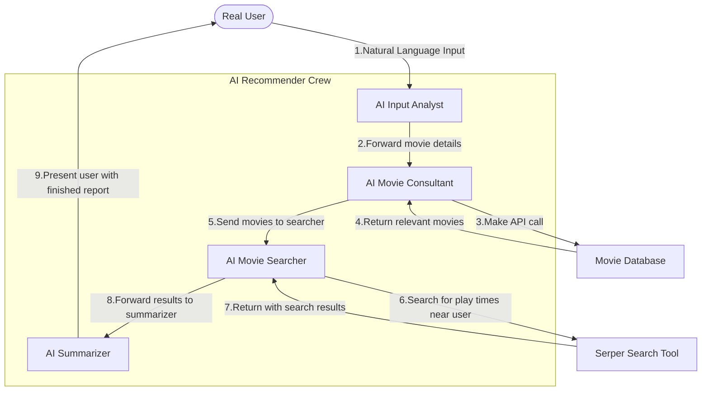
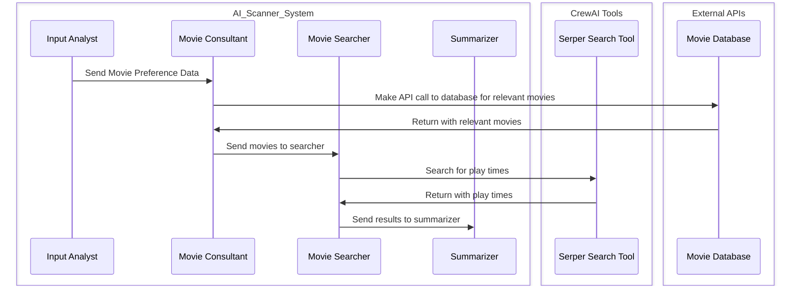

# CrewAI Powered Movie Recommender

## Project Overview
This project uses CrewAI to create ai agents with the task of making movie recommendations.\
It uses OpenAI's gpt 4o mini as the generative AI.\
It additionally uses SerperAPI for google searches, and a movie database API.\
The crew works as such:
- The analyst takes in the user's input and from that determines the type of movie that the user enjoys
- Then this analysis is given to the consultant, who uses the movie db api to search for movies of that genre
- Then the movies that the consultant comes up with are given to the searcher, who searches for which movies are being played near the user
- Finally the summarizer takes everything and returns it to the user.

## Workflow



## Programmable Chain of Thought



<!-- ## User cases -->

<!-- ```mermaid
sequenceDiagram
    participant real_user as Real User
    participant ai_scanner_system as AI Scanner System
    participant expense_claim_system as Expense Claim System

    real_user->>ai_scanner_system: Send receipt image
    alt Processed
        ai_scanner_system->>expense_claim_system: Process expense claim
        expense_claim_system->>ai_scanner_system: Confirm claim submission
        ai_scanner_system->>real_user: Notify claim approval
    else Rejected
        ai_scanner_system->>real_user: Communicate rejection rationale
    else Additional Information Required
        ai_scanner_system->>real_user: Request supplementary receipt details
        real_user->>ai_scanner_system: Provide additional receipt information
        ai_scanner_system->>expense_claim_system: Process expense claim
        expense_claim_system->>ai_scanner_system: Confirm claim submission
        ai_scanner_system->>real_user: Notify claim approval
    end
``` -->